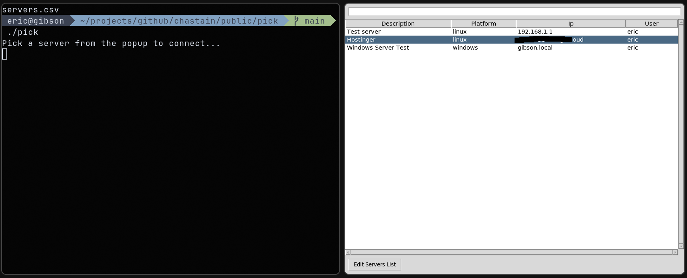

# pick.py

Launch a tk GUI and choose a server to SSH into (or Remote Desktop in Windows).

### Linux
When connecting to linux machines, a standard ssh session is launched...

### Windows
When connecting to a windows machine mstsc is used, but if you're on linux you probably cant do this, I've not needed to connect to a Windows machine from a Linux machine, otherwise this would probably be a linux Remote Desktop client, if you need to do that just modify the command in the code.

At a previous job I often needed to remote into dozens of servers a day, and keeping track of them all in a spreadsheet wasn't ideal.

To streamline things I wrote this python script to launch a TK GUI that read in the data in "servers.csv" and display the details in the grid.

When the dialog opens you can immediately start typing anything from any of the columns in the csv and the window will filter to show only the relevant rows. Up and down arrow keys to move up and down through the grid, and enter to launch the connection to that server.

The csv used as a datasource here requires 3 columns (in any order) user, ip, and platform. ip can also be the name of the server if thats easier as long as your machine can see it on the network. You can add any other columns you want but those three are used for initiating the remote connections.

The "Edit Servers List" at the bottom will try to launch the servers file in your default application for .csv files, so you can edit or remove servers at any time that way.

I also had a new password generated for me daily, I copied and pasted the new password each morning into password.txt, then when launching this code from a batch file (now the ./pick bash script) it would copy the password into the clipboard for me, then I could just paste in the password when making the ssh connection. In windows there was a batch file that used clip instead of xclip, but it used the same idea.
